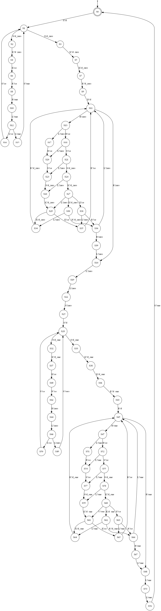

# A small experiment on the use of NFA generated from Interaction diagrams for trace analysis

## Context

### NFA generation 

We can generate NFA (Non-deterministic Finite Automata) from interaction diagrams (MSC, UML-SD etc) in certain conditions.
More precisely, it works on a subset of an interaction diagram language (with strictly sequential loops).

This generation is automated using the "[hibou_label](https://github.com/erwanM974/hibou_label)" tool.

See [hibou_nfa_generation](https://github.com/erwanM974/hibou_nfa_generation) for details.

### Trace analysis

Interactions can be used to analyse trace as a form of Offline Runtime Verification.
See e.g. the paper "[Revisiting Semantics of Interactions for Trace Validity Analysis](https://link.springer.com/chapter/10.1007%2F978-3-030-45234-6_24)".

Likewise, NFA can be used to recognize words and hence traces which are words of actions.
See e.g. the README of "[autour_process](https://github.com/erwanM974/autour_process)" for more details.

Hence we can compare the performances for trace analysis of:
- directly analyzing traces against interactions
- generating a NFA from an interaction and then analyzing traces against that NFA

Of course, not all interactions can be translated into NFA so this only concerns those that can.

## Experimentations

### Input Interaction Diagrams and generated NFA

We consider 3 usecase systems:
- A modelisation of the Alternating Bit Protocol
- A protocol for managing a platoon of autonomous rovers
- A protocol using smart contracts for human resources management

The table below describes each example on a dedicated row.
The left column provides the interaction diagram encoding of the protocol
and the right column gives the NFA generated from it.

| Usecase  | Interaction diagram  | Generated NFA  |
|---|---|---|
| ABP  |   |   |
| Rovers  |   |   |
| HR  |   |   |

### Traces generation

Using the trace generation feature of HIBOU ("[hibou_label](https://github.com/erwanM974/hibou_label)" tool) we generate
three datasets of traces, one for each example usecase.

Each dataset consists of:
- a set of accepted prefixes denoted as "ACP"
- a set of error traces denoted as "ERR", obtained by adding random actions at the end of accepted traces

Because of randomization during the generation process, different generations may yield distinct datasets.
The original dataset used later in plots is given in the "data_archive.zip" archive.

### Correctness of analyses

As a form of experimental validation of our translation and RV algorithm we compare the results of analyzing the traces
using interaction global trace analysis and the NFA RV algorithm.

We can make sure that:
- for the ACP, both interaction trace analysis and nfa trace analysis returns a Pass
- for the ERR, both process return the same verdict

For interaction trace analysis we use the algorithm from "[Revisiting Semantics of Interactions for Trace Validity Analysis](https://link.springer.com/chapter/10.1007%2F978-3-030-45234-6_24)" for ACPT traces

For NFA trace analysis we use the one from "[autour_process](https://github.com/erwanM974/autour_process)" 
with the policy set to stop and return a Fail at the first observed deviation.

We run both methods on all traces (3 usecases, 1500 traces per usecase).
For the 3 examples, we run both methods on all generated traces and we 
store results and computation times (median of several tries) in a ".csv" file containing the experimental data.
The original files are given in the "data_archive.zip" archive.

### Performances

We may also compare the time (median of 3 tries) required to perform the analyses using both methods.
We exploit the ".csv" file to plot results using the "R_plot.r" r script.

In the following we present results obtained running the experiment on an
 Intel(R) Core(TM) i5-6360U CPU @ 2.00GHz 1.99 GHz
 with 8.00 GB RAM.
 
We have used HIBOU version 0.8.5.

With the R code comprised in this repository, we extract statistical information from the "csv" tables that are generated
and draw scatterplots to represent the results graphically.

In those plots, each point corresponds to a given trace.
Its position corresponds to the time taken to analyse it (on the *y* axis), and its length i.e. total number of actions (on the *x* axis, with some jitter added to better see distinct points).

The color represents the method used, 
*blue* for interaction global trace analysis 
and 
*green* for nfa word analysis.

| Usecase  | Accepted traces  | Error traces  |
|---|---|---|
| ABP  |   |   |
| Rovers  |   |   |
| HR  |   |   |

#### Interpretation of the results

The time in plots is represented in LOG scale.
We observe a gain of 2 orders of magnitude using the NFA method over the interaction-based method.

The presence or absence of deviations does not impact the rate at which the NFA method operates.
But this is not the case for the interaction based method which may be more costly for error traces than for accepted traces.

We can approximate the rates at which actions can be analyzed (in actions per second)
 for the traces of our datasets.

Let us recall the experiments were run on an
 Intel(R) Core(TM) i5-6360U CPU @ 2.00GHz 1.99 GHz
 with 8.00 GB RAM.
 
Let us also recall that NFA generation if only available for a strict subset of the interaction language.
Hence, even though NFA trace analysis is more advantageous in terms of performances,
interaction-based trace analysis may still be necessary for interactions that cannot be translated to NFA.

 